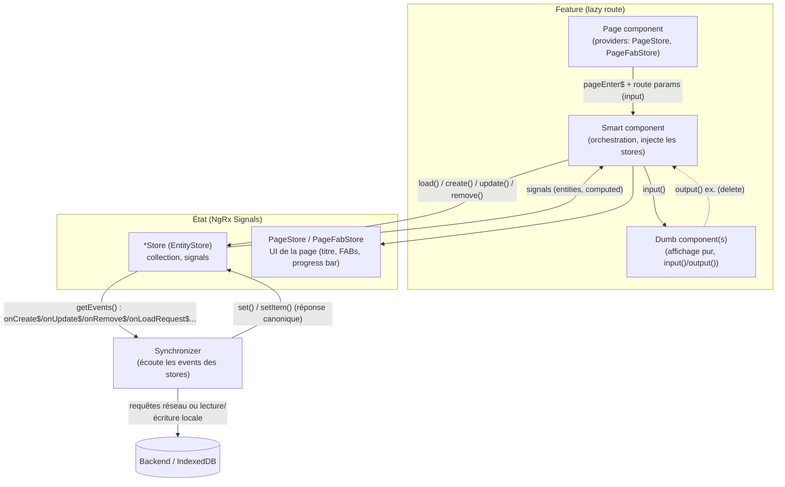
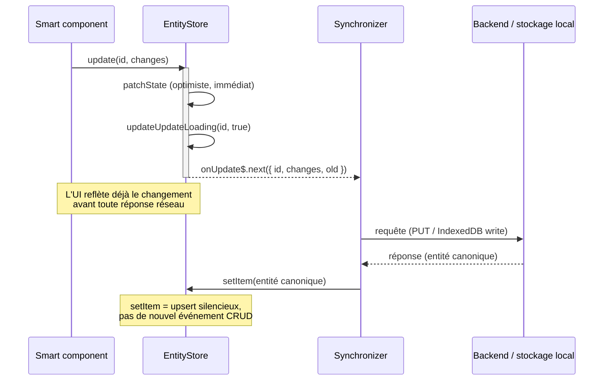
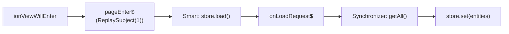

#architecture #angular #ngrx-signals

Architecture front récurrente sur plusieurs projets Angular perso —
**stores NgRx Signals + synchronizers**, découpage **page / smart / dumb**.
Vérifiée directement dans [[TaskManager]] et [[chatVault]] (code lu dans les
deux dépôts) ; [[mongoManager]] déclare suivre le même découpage page/smart/dumb
et `signalStore`/`withEntities` (« pattern repris du repo voisin TaskManager »
d'après sa propre doc), non revérifié ici en détail. Le socle générique
(`createEntityMethods`) est désormais porté dans [[CommonAngular]] plutôt que
dupliqué dans chaque projet.

---

## Vue d'ensemble



Deux idées structurent tout : **les composants ne parlent jamais au réseau**
(seuls les stores et les synchronizers le font), et **l'état est découplé de
son "épaisseur"** (front pur/optimiste dans le store, aller-retour réel dans
le synchronizer).

## Découpage par feature : page / smart / dumb

Chaque feature (`task`, `conversation`, …) est une route lazy-loadée. À
l'intérieur, 3 niveaux stricts :

| Niveau | Rôle | Peut injecter un store ? |
|---|---|---|
| **`page`** (`*.page.component.ts`) | Appelé par le router. Lit les params de route, les propage en `input()` aux smarts. Fournit les stores **locaux à la page** (`providers: [PageStore, PageFabStore]`). | Non (juste `ActivatedRoute`) |
| **`smart`** (`*.component.ts`) | Injecte les stores et services, orchestre (mutations, ouverture de modales). Compose des dumbs, ne fait pas d'affichage complexe lui-même. | Oui |
| **`dumb`** (`*.component.ts`, souvent dans `shared/dumb`) | Affichage pur : uniquement `input()`/`output()`. Réutilisable, testable, aucun effet de bord. | **Jamais** |

Règle d'or : pas de duplication — chercher un dumb existant dans `shared/dumb`
avant d'en écrire un nouveau.

## Les deux familles de stores

### 1. Store de collection — `createEntityMethods<T>()`

Base générique pour tout store qui gère une **collection** d'entités
(`ITask[]`, `IConversation[]`, …), construite sur `withEntities` de
`@ngrx/signals/entities`. Portée dans [[CommonAngular]] (`entity-store.ts`),
identique à celle de TaskManager/chatVault.

```ts
@Injectable({ providedIn: 'root' })
export class TasksStore extends signalStore(
  withEntities<ITask>(),
  // Slices requis, cf. §Pièges connus.
  withState({ creationLoading: [] as string[], updateLoading: [] as string[], deleteLoading: [] as string[] }),
  withMethods((store) => createEntityMethods<ITask>()(store)),
) {}
```

Fournit CRUD (`add`/`create`/`update`/`remove`/`set`/`clear`), lecture
(`getById`/`getByIds`/`getFirst`/`getLast`/`count`/`exists`), requêtage
(`query(filters, sorts)`), chargement ciblé (`load`/`loadByIds`/
`addIdToLoad`/`removeIdToLoad`), suivi de mutations en cours
(`isCreationLoading`/`isUpdateLoading`/`isDeleteLoading`), et surtout
`getEvents()` — les subjects consommés par le synchronizer (cf. ci-dessous).

Un store de feature (ex. `TasksStore`) étend cette base avec ses propres
transitions métier (ex. `setTaskToDone`, `setTaskPostponed`), qui suivent le
même schéma : patch optimiste + subject dédié pour le synchronizer.

### 2. Store de page — `PageStore` / `PageFabStore`

État **UI, local à une page** (pas une collection) : titre de la barre
supérieure, menu latéral activé/non, barre de progression, FABs (boutons
d'action flottants), barre de filtres (recherche/catégories), action sheet.
Fourni en `providers` **de la page** (pas `providedIn: 'root'`) : chaque page
a sa propre instance, remise à zéro à la navigation.

## Flux de données : CQRS-léger via subjects



1. Un smart appelle une méthode de mutation du store (`update`, `create`,
   `remove`, ou une transition métier dédiée) → l'état signal est patché
   **immédiatement** (UI optimiste), **et** un subject est émis
   (`getEvents().onUpdate$`, etc.).
2. Le **synchronizer** (service `@Injectable`, pas `providedIn: 'root'` —
   instancié et démarré explicitement via `init()`) s'abonne à ces subjects
   et effectue le travail réel : requête backend, écriture IndexedDB,
   cohérence inter-entités.
3. Le synchronizer applique la réponse canonique via `setItem`/`set` (upsert
   silencieux, pas de nouvel événement CRUD — pas de boucle).

### Deux profils de synchronizer observés

- **Réseau (pattern TaskManager)** : le synchronizer traduit chaque event en
  appel HTTP vers le backend, gère aussi la cohérence entre entités liées (ex.
  retirer un `tagId` d'une entité liée à sa suppression). *Pas encore présent
  dans TaskManager au moment de cette note — à créer sur le modèle chatVault.*
- **Cohérence locale (chatVault)** : pas de backend réseau (stockage local) —
  le synchronizer (`SynchronizerService.init()`, un `*Handle()` par entité)
  maintient la cohérence entre stores liés (ex. suppression d'un tag →
  nettoyage des `tagIds` dans les conversations concernées ; suppression d'un
  média → nettoyage des références dans messages/utilisateurs) et pilote des
  migrations de données ponctuelles. Le principe (s'abonner aux events du
  store, réagir) est identique, seule la "cible" change (backend vs autres
  stores/stockage local).

> Conséquence commune aux deux profils : **aucune requête réseau ou d'accès
> aux données hors synchronizer/service** — les composants ne parlent qu'aux
> stores.

## Chargement à la demande (par page)

Aucun chargement de données au boot de l'app (`AppComponent`/`init()` ne fait
que brancher les handlers des synchronizers). C'est **chaque page** qui
demande les stores dont elle a besoin, à son entrée :



- `pageEnter$` (`ReplaySubject(1)`, émis sur `ionViewWillEnter` côté Ionic)
  garantit qu'un smart abonné après la première entrée la reçoit quand même —
  **pas** d'appel équivalent en `ngOnInit`, qui déclencherait une requête en
  double.
- Une page charge **tous** les stores que sa vue consomme, y compris via ses
  dumbs (ex. une liste de tâches affichant les catégories charge
  `TasksStore` **et** `CategoriesStore`).
- Chargement ciblé pour une vue détail : `addIdToLoad`/`removeIdToLoad`
  plutôt qu'un `load()` complet.

## Pièges connus (vérifiés en review)

> [!warning] Slices de loading obligatoires
> Tout store utilisant `createEntityMethods` doit déclarer
> `withState({ creationLoading: [], updateLoading: [], deleteLoading: [] })` :
> `create`/`update`/`remove` les patchent mais ne les créent pas. Absents →
> aucune erreur de compilation, **crash au runtime** au premier appel
> (`TypeError: store.updateLoading is not a function`). Déjà arrivé deux fois
> dans TaskManager.

- Un composant **dumb** ne doit jamais injecter un store.
- Pas de chargement de données au boot ; `store.load()` uniquement sur
  `pageEnter$`, jamais en plus en `ngOnInit`.
- `PageStore`/`PageFabStore` fournis en `providers` de la page, jamais en
  root (sinon état partagé entre pages par erreur).
- Souscriptions RxJS toujours nettoyées (`takeUntil(destroy$)` /
  `takeUntilDestroyed()`).

## Récapitulatif par projet

| Projet | Page/smart/dumb | EntityStore (`createEntityMethods`) | Synchronizer | Backend |
|---|---|---|---|---|
| [[TaskManager]] | ✅ | ✅ (`entities.store.ts`) | ⚠️ pas encore créé (prévu sur le modèle chatVault) | Rust (dépôt séparé) |
| [[chatVault]] | ✅ | ✅ (`entities.store.ts`, identique) | ✅ (`SynchronizerService`) | Aucun (stockage local) |
| [[mongoManager]] | déclaré (doc du projet) | déclaré (`signalStore`/`withEntities`) | non vérifié | Rust ([[MongoManagerBackend]]) |
| [[CommonAngular]] | — (librairie, pas d'app) | ✅ portée en librairie partagée (`createEntityMethods`) | — | — |

## Liens
- [[CommonAngular]] — portage partagé de `createEntityMethods` (EntityStore), `ConfigService`, `HttpService`
- [[TaskManager]]
- [[chatVault]]
- [[mongoManager]]
